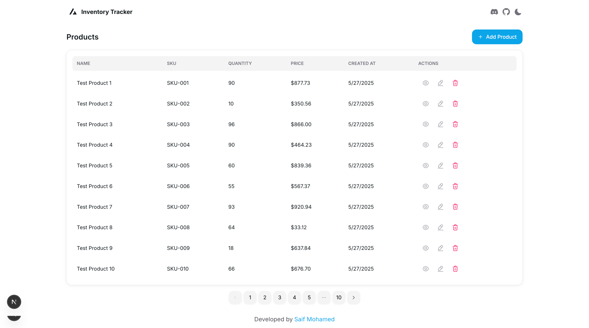

# 🏪 Inventory Tracker

A powerful and intuitive inventory management system built with modern web technologies. This application helps businesses streamline their stock management process with real-time tracking, user-friendly interface, and robust features.



## ✨ Features

- 📊 Real-time inventory tracking
- 🔄 Stock level monitoring
- 📱 Responsive design for all devices
- 🌓 Light/Dark mode support
- 🔐 Secure authentication
- 📈 Sales tracking and reporting
- 🎯 User-friendly interface
- 🔍 Quick search and filtering
- 📱 Mobile-first approach

## 🛠️ Tech Stack

- **Framework:** Next.js 14
- **Language:** TypeScript
- **Styling:** Tailwind CSS
- **Database:** Prisma with PostgreSQL
- **Authentication:** NextAuth.js
- **UI Components:** HeroUI
- **State Management:** React Context
- **Deployment:** Vercel

## 🚀 Getting Started

### Prerequisites

- Node.js 18+
- PostgreSQL
- npm or yarn

### Installation

1. Clone the repository

```bash
git clone https://github.com/saifmohamedsv/inventory-tracker.git
cd inventory-tracker
```

2. Install dependencies

```bash
npm install
# or
yarn install
```

3. Set up environment variables

```bash
cp .env.example .env.local
```

Fill in your environment variables in `.env.local`

4. Run database migrations

```bash
npx prisma migrate dev
```

5. Start the development server

```bash
npm run dev
# or
yarn dev
```

Visit `http://localhost:3000` to see the application.

## 📦 Project Structure

```
inventory-tracker/
├── app/                # Next.js app directory
│   ├── api/           # API routes
│   ├── components/    # React components
│   └── lib/          # Utility functions
├── config/           # Configuration files
├── prisma/          # Database schema and migrations
├── public/          # Static assets
└── styles/          # Global styles
```

## 🔧 Configuration

The application can be configured through environment variables:

- `DATABASE_URL`: PostgreSQL connection string
- `NEXTAUTH_SECRET`: Secret for NextAuth.js
- `NEXTAUTH_URL`: Your application URL

## 🤝 Contributing

Contributions are welcome! Please feel free to submit a Pull Request.

1. Fork the repository
2. Create your feature branch (`git checkout -b feature/AmazingFeature`)
3. Commit your changes (`git commit -m 'Add some AmazingFeature'`)
4. Push to the branch (`git push origin feature/AmazingFeature`)
5. Open a Pull Request

## 📝 License

This project is licensed under the MIT License - see the [LICENSE](LICENSE) file for details.

## 👨‍💻 Author

**Saif Mohamed**

- Portfolio: [saifmohamedsv.vercel.app](https://saifmohamedsv.vercel.app)
- GitHub: [@saifmohamedsv](https://github.com/saifmohamedsv)
- Twitter: [@saifmohamed_swe](https://twitter.com/saifmohamed_swe)
- LinkedIn: [saifmohamedsv](https://linkedin.com/in/saifmohamedsv)

## 🙏 Acknowledgments

- [Next.js](https://nextjs.org/)
- [Prisma](https://www.prisma.io/)
- [Tailwind CSS](https://tailwindcss.com/)
- [HeroUI](https://heroui.com/)
- [Vercel](https://vercel.com/)

---

⭐️ If you like this project, please give it a star on GitHub!
